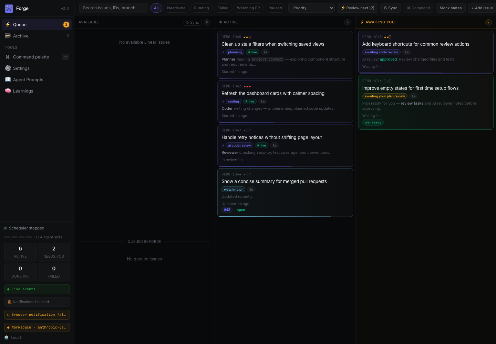
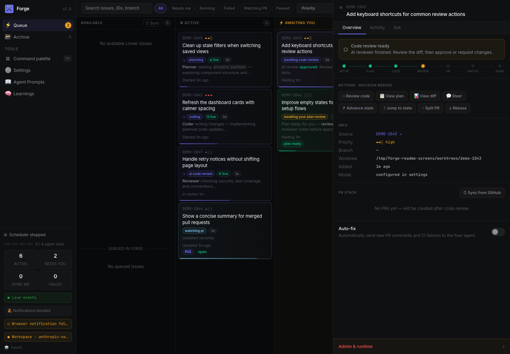
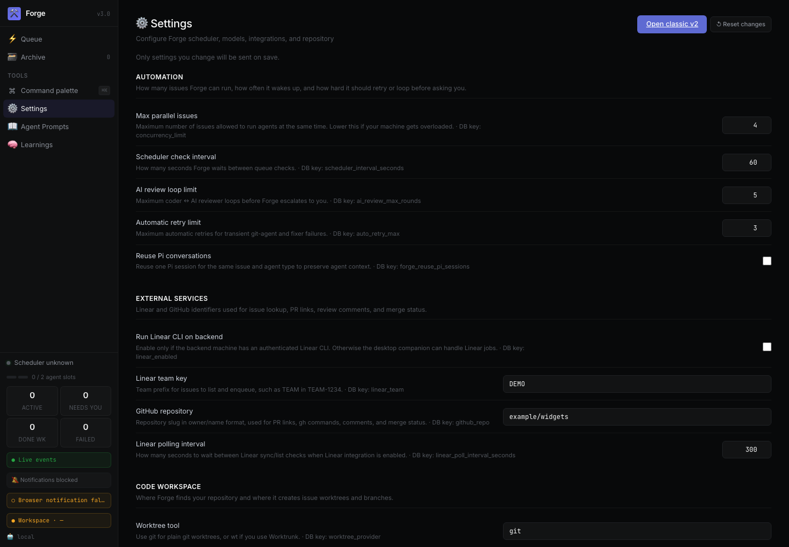

# Forge

Forge is an AI issue factory for Linear-backed engineering work. It turns an issue into a tracked project, plans it, implements it in an isolated worktree, reviews it with AI, waits for human gates, creates/pushes PRs, watches GitHub, loops on review comments, and closes the issue when the stack is merged.

It can run as:

- a **standalone backend**: scheduler, agents, [SQLite](https://www.sqlite.org/) DB, REST/SSE dashboard
- a **desktop app**: native macOS window plus local CLI bridge for tools that must run on your laptop
- an optional **[pi](https://github.com/earendil-works/pi-coding-agent) extension shim**: `/forge` commands inside pi

Dashboard: <http://localhost:3142>

---

## Screenshots

The screenshots below use a sanitized demo database. Issue IDs, titles, repository names, and paths are fictional.

### Pipeline dashboard



### Human review workspace



### Runtime settings



---

## What Forge does

```text
Linear issue
  │
  ▼
PENDING → SETTING_UP → PLANNING → AI_PLAN_REVIEWING
                                      │
                           approved  ▼  needs changes
                         AWAITING_PLAN_APPROVAL ──┐
                                      │            │
                         human approves            │
                                      ▼            │
                                  WORKING ◄────────┘
                                      │
                                      ▼
                               AI_REVIEWING
                                      │
                           approved  ▼  needs changes
                         AWAITING_CODE_REVIEW ─────┐
                                      │             │
                         human approves             │
                                      ▼             │
                                CREATING_PR         │
                                      │             │
                                      ▼             │
                                WATCHING_PR         │
                         merged  │   │ review comments
                                 ▼   ▼
                                DONE AWAITING_FIX_APPROVAL
                                           │
                              human approves
                                           ▼
                                      FIXING → PUSHING → WATCHING_PR
```

Special states: `PAUSED`, `FAILED`, `IGNORED`, `IN_MERGE_QUEUE`, `DONE`.

---

## Capabilities

### Issue intake and tracking

- Enqueue Linear issues by ID.
- Create manual issues without Linear.
- Pull issue title, description, comments, assignee context, and priority from Linear.
- List assigned Linear issues from the dashboard when the desktop bridge is connected.
- Track every issue in SQLite with current state, previous state, priority, locks, worktree path, project file path, retry count, and review counters.
- Pause, resume, ignore, unignore, reset, retry, advance, and delete tracked issues.
- Add steering instructions that the next agent run must read before continuing.

### Planning

- Create a per-issue `projects/{id}/plan.md` working document.
- Ask a planner agent to turn issue context into a concrete implementation plan.
- Run an AI plan-reviewer before human approval.
- Loop back to planning when the plan reviewer requests changes.
- Queue a human plan approval decision before code work begins.

### Code implementation

- Create isolated git worktrees for each issue.
- Support raw [`git worktree`](https://git-scm.com/docs/git-worktree) and optional Worktrunk (`wt`) worktree creation.
- Run a coder agent against the issue plan, Linear context, steering, and review feedback.
- Preserve per-issue logs and agent output.
- Support configurable agent concurrency.
- Support per-agent model overrides.
- Support optional reuse of pi conversations for the same issue and agent type.

### Review and approval gates

- Run an AI code-reviewer before human code review.
- Loop back to the coder when AI review finds issues.
- Track per-cycle and cumulative AI review round counts.
- Escalate to humans after a configurable maximum number of AI review loops.
- Queue human decisions for plan review, code review, fix approval, and split approval.
- Approve or reject decisions from the dashboard or `/forge` commands.
- Preserve decision feedback for the next agent run.

### Pull requests and GitHub automation

- Ask a git-agent to create branches, commits, pushes, and PRs.
- Track a PR stack per issue.
- Sync PR numbers and PR state from GitHub.
- Poll PR review decision, mergeability, checks, review comments, and merge state with `gh`.
- Detect merged PRs and mark issues done.
- Detect review comments and route them into the fix workflow.
- Support merge queue / `IN_MERGE_QUEUE` tracking.
- Generate completion summaries when work finishes.

### Fix loops and resilience

- Queue review comments for human fix approval.
- Run a fixer agent to address approved PR feedback.
- Push fixes and return to PR watching.
- Auto-retry transient git-agent and fixer failures up to a configurable limit.
- Reap stale locks using state-specific timeout windows.
- Preserve failed issues for inspection and manual retry.

### Dashboard

- Web dashboard with REST API and server-sent events.
- Pipeline view for active work and items awaiting humans.
- Issue detail panel with overview, activity, ask, plan, PR stack, and actions.
- Diff/review workspace for human code review.
- Archive view for completed work.
- Settings UI for runtime, model, repo, Linear, GitHub, worktree, and VM options.
- Prompt editor for all agent system prompts.
- Learnings view for accumulated review patterns.
- Live agent-output streaming for running agents.
- Browser notification support.

### Desktop app and bridge

- Native macOS desktop window powered by [Deno Desktop](https://docs.deno.com/runtime/reference/desktop/).
- Connect to a local or VM-hosted Forge backend.
- Persist backend selection in `~/.config/forge/forge-desktop.json`.
- Run Linear CLI jobs locally on macOS while the VM owns the database.
- Fetch Linear issue details, sync Linear issue state, and list assigned issues through the desktop bridge.

### VM and workspace support

- Run backend, scheduler, agents, and GitHub automation inside a Linux/Orb VM.
- Use macOS desktop bridge for Linear CLI when the backend runs in the VM.
- Configure host/VM path prefix mapping.
- Configure workspace-run commands for frontend, backend, and database workflows.
- Support local-first setups and VM-backed setups.

### Observability and audit trail

- Store every agent run with start time, exit time, exit code, and log path.
- Store activity events for state changes, decisions, steering, retries, failures, and completion.
- Store archived AI review verdicts.
- Generate `summary.md` at completion.
- Expose issue, decision, run, activity, diff, prompt, settings, archive, and desktop job APIs.

### Extensibility

- Agent prompts are plain Markdown files in `agents/`.
- State machine is explicit in `scheduler.ts` and `agent-runner.js`.
- Database schema and migrations are centralized in `db.ts`.
- Optional pi extension shim exposes `/forge` commands.
- Snapshot script safely publishes sanitized daily GitHub snapshots.

---

## Architecture

| Piece | Purpose |
|---|---|
| `forge.db` | [SQLite](https://www.sqlite.org/) source of truth for issues, decisions, runs, PR stack, settings, desktop jobs |
| `scheduler.ts` | Picks schedulable issues and starts agents |
| `setup.js` | Creates worktrees and project files |
| `agent-runner.js` | Runs planner/coder/reviewer/git/fixer agents via the [pi SDK](https://github.com/earendil-works/pi-coding-agent) |
| `watcher.js` | Polls GitHub PR/review/merge state |
| `dashboard/server.js` | [Express](https://expressjs.com/) API + SSE dashboard backend |
| `dashboard/frontend/src/` | [Preact](https://preactjs.com/) dashboard source |
| `desktop/main.ts` | [Deno Desktop](https://docs.deno.com/runtime/reference/desktop/) wrapper and local CLI bridge |
| `agents/*.md` | Editable system prompts for each agent |
| `projects/{id}/plan.md` | Per-issue working document |

---

## External projects Forge builds on

| Project | Forge uses it for |
|---|---|
| [pi coding agent](https://github.com/earendil-works/pi-coding-agent) | LLM model registry, provider auth, and agent session execution |
| [Linear CLI (`schpet/linear-cli`)](https://github.com/schpet/linear-cli) | Linear issue fetch, assigned issue listing, and state sync |
| [Git](https://git-scm.com/) / [`git worktree`](https://git-scm.com/docs/git-worktree) | Branches, commits, diffs, pushes, and isolated per-issue worktrees |
| [GitHub CLI (`gh`)](https://cli.github.com/) | PR creation support, PR status, reviews, checks, comments, and merge state |
| [SQLite](https://www.sqlite.org/) | Local durable state in `forge.db` |
| [`better-sqlite3`](https://github.com/WiseLibs/better-sqlite3) | Node.js SQLite driver |
| [Express](https://expressjs.com/) | Dashboard/API server |
| [Preact](https://preactjs.com/) | Dashboard frontend |
| [Deno](https://deno.com/) and [Deno Desktop](https://docs.deno.com/runtime/reference/desktop/) | Native desktop wrapper and macOS CLI bridge |
| [Worktrunk (`wt`)](https://github.com/lukewh/worktrunk) | Optional worktree provider |
| [Node.js](https://nodejs.org/) / [npm](https://www.npmjs.com/) | Runtime and dependency management |
| [Vite](https://vite.dev/) | Dashboard frontend build |
| [TypeScript](https://www.typescriptlang.org/) | Dashboard type checking and Forge TS modules |

---

## Prerequisites

Install these **before** running setup.

### Required everywhere Forge backend/agents run

- **[Node.js](https://nodejs.org/) 22+** and **[npm](https://www.npmjs.com/)**
- **[git](https://git-scm.com/)**
- Native build tooling for [`better-sqlite3`](https://github.com/WiseLibs/better-sqlite3):
  - macOS: Xcode Command Line Tools (`xcode-select --install`)
  - Linux/Orb VM: `build-essential`, `python3`, `make`, `g++`
- **[pi SDK](https://github.com/earendil-works/pi-coding-agent) credentials/config** for the user running Forge agents
  - Forge imports [`@earendil-works/pi-coding-agent`](https://www.npmjs.com/package/@earendil-works/pi-coding-agent) and uses the same model/provider auth as pi.
  - Verify pi can run with the model configured in Forge settings.
- Access to the target git repository.
- A writable worktree directory.

### Required for GitHub automation

- **[GitHub CLI](https://cli.github.com/)**: `gh`
- Authenticated GitHub session for the user running the Forge backend/scheduler:

```bash
gh auth login
gh auth status
gh repo view OWNER/REPO
```

Forge uses `gh` for PR discovery, PR status, review comments, CI checks, and merge queue polling. If the backend runs inside a VM, `gh` must be installed and authenticated inside that VM.

### Required for Linear automation

Choose one of these modes:

1. **Recommended for VM backend:** run Linear through the macOS desktop bridge.
   - Install/authenticate [`linear`](https://github.com/schpet/linear-cli) on macOS.
   - Run the Forge desktop app on macOS.
   - Keep `linear_enabled=false` on the VM backend.
2. **Local-only backend:** install/authenticate [`linear`](https://github.com/schpet/linear-cli) on the same machine as Forge and set `linear_enabled=true`.

Verify:

```bash
linear --version
linear --help
# Then run your organization's Linear CLI auth flow.
```

### Required for the desktop app

- macOS with **[Deno](https://deno.com/) 2.9+** and [Deno Desktop](https://docs.deno.com/runtime/reference/desktop/) support
- Local macOS CLI tools:
  - [`linear`](https://github.com/schpet/linear-cli) authenticated for issue fetch/state sync through the desktop bridge
  - `gh` authenticated for opening, inspecting, and manually debugging GitHub state from the same desktop environment

```bash
deno --version
gh auth status
linear --version
```

Tool placement when the backend runs on a VM:

| Tool | Must exist on VM/backend? | Must exist on macOS desktop? | Why |
|---|---:|---:|---|
| `git` | Yes | Optional | Backend agents create branches, diffs, commits, and pushes |
| `gh` | Yes | Recommended | Backend watcher uses `gh`; local `gh` is useful for desktop/manual PR inspection |
| `linear` | No, if using bridge | Yes | Desktop bridge runs Linear CLI locally and reports back to VM |
| `node`/`npm` | Yes | Yes if running desktop from checkout | Backend services and local package scripts |
| `deno` | No | Yes | Native desktop app |

Current desktop bridge jobs are Linear-focused. GitHub automation still runs on the backend, so authenticate `gh` inside the VM as well as locally.

### Optional

- **[Worktrunk](https://github.com/lukewh/worktrunk)** (`wt`) if you want `worktree_provider=wt` instead of raw [`git worktree`](https://git-scm.com/docs/git-worktree).
- SSH access to your VM, e.g. `ssh orb`, if running Forge in Orb.

---

## Installation

### 1. Install Forge backend on the VM

Use this when agents should run in the Linux/Orb environment.

```bash
ssh orb

# Linux prerequisites
sudo apt-get update
sudo apt-get install -y git gh python3 make g++ build-essential

# Get Forge
cd /home/$USER
git clone <FORGE_REPO_URL> forge
cd /home/$USER/forge

# Install Node dependencies
npm ci

# Authenticate GitHub in the VM
gh auth login
gh auth status
```

Run first-time setup:

```bash
cd /home/$USER/forge
npm run forge -- setup
```

Recommended VM answers:

| Prompt | Typical value |
|---|---|
| Worktree provider | [`git`](https://git-scm.com/) |
| Main git repo path | absolute path to your repo inside the VM |
| Directory for new git worktrees | `/home/$USER/Projects` or another VM path |
| Branch prefix | your GitHub username or preferred branch namespace |
| Default branch | `main` |
| Enable Linear CLI integration? | `false` when using the desktop bridge |
| Linear team key | your team key, e.g. `BAND` |
| GitHub repo | `owner/repo` |
| Agent concurrency limit | `2` to start |
| Default model | a model available in your pi config |

Start the backend:

```bash
cd /home/$USER/forge
npm run dashboard -- --port 3142
npm run forge -- start
```

Or run the restart helper if present in your checkout:

```bash
./start-forge.sh
```

Verify:

```bash
curl -sS http://localhost:3142/api/overview
```

If accessing from macOS, expose the VM port however your VM is configured, or use SSH forwarding:

```bash
ssh -N -L 3142:localhost:3142 orb
```

### 2. Install the local macOS desktop app and CLI bridge

The desktop app gives you a native Forge window and lets macOS run CLI jobs for tools that are awkward or unavailable in the VM, especially Linear.

```bash
# macOS prerequisites
brew install gh deno

# Install/auth GitHub locally
gh auth login
gh auth status

# Install/auth Linear locally with schpet/linear-cli:
# https://github.com/schpet/linear-cli
linear --version
linear --help
```

Run the desktop app from the Forge checkout on macOS:

```bash
cd ~/.pi/agent/extensions/forge
npm ci

# Connect to a VM backend
FORGE_BACKEND_ORIGIN=http://localhost:3142 npm run desktop
```

If you forwarded `orb:3142` to local `localhost:3142`, keep `FORGE_BACKEND_ORIGIN=http://localhost:3142`.

You can also open `/desktop/backend` in the app and persist the backend URL to:

```text
~/.config/forge/forge-desktop.json
```

Desktop bridge behavior:

- polls the backend at `/api/desktop/jobs`
- runs Linear CLI jobs locally on macOS
- posts results back to the backend
- lets the VM remain the sole owner of `forge.db`

### 3. Optional: run Forge purely locally

```bash
cd ~/.pi/agent/extensions/forge
npm ci
npm run forge -- setup
npm run dashboard -- --port 3142
npm run forge -- start
npm run desktop
```

For a local-only backend you may set `linear_enabled=true` during setup if `linear` is installed/authenticated locally.

---

## Agent setup checklist

Use this exact checklist when preparing a new machine for Forge agents.

```bash
# 1. Runtime
node --version       # must be 22+
npm --version
git --version

# 2. GitHub CLI in the backend environment
gh --version
gh auth status
gh repo view OWNER/REPO

# 3. Forge dependencies
cd /path/to/forge
npm ci

# 4. pi/model auth
# Verify the same user can run pi with the intended Forge model.

# 5. Repository/worktree access
git -C /path/to/main/repo rev-parse --show-toplevel
git -C /path/to/main/repo worktree list --porcelain
mkdir -p /path/to/worktree/root

# 6. First-run setup
npm run forge -- setup

# 7. Start services
npm run dashboard -- --port 3142
npm run forge -- start

# 8. Health check
curl -sS http://localhost:3142/api/overview
```

For VM deployments, run steps 1–8 **inside the VM**. Do not assume macOS CLI auth is visible to the VM.

For Linear with a VM backend, additionally run on macOS:

```bash
linear --version
gh auth status
cd ~/.pi/agent/extensions/forge
FORGE_BACKEND_ORIGIN=http://localhost:3142 npm run desktop
```

---

## Daily usage

```bash
# Start dashboard
npm run dashboard -- --port 3142

# Start scheduler
npm run forge -- start

# Add a Linear issue
npm run forge -- add TEAM-1234

# Add a manual issue
npm run forge -- add "Refactor pricing filters"

# List tracked issues
npm run forge -- list
```

Open <http://localhost:3142> for approvals, steering, logs, diffs, PR stack, settings, and prompt editing.

---

## Optional pi slash commands

If the optional [pi](https://github.com/earendil-works/pi-coding-agent) extension shim is loaded:

| Command | Description |
|---|---|
| `/forge` | Status overview |
| `/forge setup` | First-run setup instructions |
| `/forge start` / `/forge stop` | Start or stop scheduler |
| `/forge dashboard` | Start dashboard server |
| `/forge add TEAM-1234` | Enqueue a Linear issue |
| `/forge add "title"` | Add a manual issue |
| `/forge list` | List issues |
| `/forge queue` | Pending human decisions |
| `/forge approve <decision-id>` | Approve a decision |
| `/forge reject <decision-id> [feedback]` | Reject with feedback |
| `/forge pause <issue-id>` / `/forge resume <issue-id>` | Pause/resume |
| `/forge ignore <issue-id>` / `/forge unignore <issue-id>` | Ignore/unignore |
| `/forge steer <issue-id> <text>` | Add steering instructions |
| `/forge reset` | Destructive DB reset |

---

## Agents

| Agent | Handles | Script |
|---|---|---|
| `setup` | `SETTING_UP → PLANNING` | `setup.js` |
| `planner` | `PLANNING → AI_PLAN_REVIEWING` | `agent-runner.js` |
| `plan-reviewer` | `AI_PLAN_REVIEWING → AWAITING_PLAN_APPROVAL` or back to `PLANNING` | `agent-runner.js` |
| `coder` | `WORKING → AI_REVIEWING` | `agent-runner.js` |
| `reviewer` | `AI_REVIEWING → AWAITING_CODE_REVIEW` or back to `WORKING` | `agent-runner.js` |
| `git-agent` | `CREATING_PR → WATCHING_PR`, `PUSHING → WATCHING_PR` | `agent-runner.js` |
| `fixer` | `FIXING → PUSHING` | `agent-runner.js` |
| `watcher` | `WATCHING_PR` / `IN_MERGE_QUEUE` → `DONE` or `AWAITING_FIX_APPROVAL` | `watcher.js` |

Prompts live in `agents/{type}.md` and are editable from the dashboard.

---

## Settings

Settings are stored in `forge.db` and editable from the dashboard.

| Key | Description |
|---|---|
| `setup_completed` | Blocks scheduling until first-run setup is complete |
| `concurrency_limit` | Max concurrent agent runs |
| `scheduler_interval_seconds` | Scheduler tick interval |
| `dashboard_port` | Dashboard port, default `3142` |
| `model` | pi model used by agents |
| `worktree_provider` | `git` or `wt` |
| `repo_root` | Main repo path for raw git worktrees |
| `worktree_root` | Root directory for created git worktrees |
| `wt_root` | Worktrunk root when using `wt` |
| `branch_prefix` | Branch namespace/prefix |
| `default_branch` | Base branch for new work |
| `github_repo` | GitHub repo as `owner/repo` |
| `linear_enabled` | Server-side Linear CLI integration toggle |
| `linear_team` | Linear team key |
| `ai_review_max_rounds` | Max AI review loops before human escalation |
| `auto_retry_max` | Max transient retry attempts for git/fixer phases |

---

## Project files

Each issue gets a directory under `projects/{id}/`.

| File | Description |
|---|---|
| `plan.md` | Primary working document and TODO list |
| `run-{N}-{type}.log` | JSONL agent logs |
| `summary.md` | Completion summary |
| `verdicts/*.json` | Archived AI review verdicts |

---

## Development

```bash
# Syntax checks
node --check dashboard/server.js
node --check setup.js
node --check agent-runner.js

# Dashboard frontend
npm run dashboard:check
npm run dashboard:build

# Tests
npm test
node --test test/db.test.mjs
node --test test/scheduler.test.mjs
node --test test/dashboard.test.mjs
```

Dashboard frontend source is in `dashboard/frontend/src/`. Built assets are emitted to `dashboard/public/v3/`.

---

## Troubleshooting

### `gh` works on macOS but Forge cannot see PRs

Authenticate `gh` in the backend environment. If Forge runs in a VM:

```bash
ssh orb 'gh auth status'
ssh orb 'gh repo view OWNER/REPO'
```

### Linear does not sync from a VM backend

Use the desktop bridge:

```bash
# VM/backend setting
linear_enabled=false

# macOS
FORGE_BACKEND_ORIGIN=http://localhost:3142 npm run desktop
```

### Agents cannot create worktrees

Check settings and permissions:

```bash
git -C /path/to/repo worktree list --porcelain
mkdir -p /path/to/worktree/root
touch /path/to/worktree/root/.forge-write-test
rm /path/to/worktree/root/.forge-write-test
```

### Dashboard is stale after pulling changes

```bash
pkill -f "forge-dashboard" || true
npm run dashboard -- --port 3142
```

---

## Related docs

- [`AGENTS.md`](AGENTS.md) — developer guide for agents working on Forge
- [`docs/workspace-run.md`](docs/workspace-run.md) — per-worktree command execution
- [`docs/DASHBOARD_FRONTEND.md`](docs/DASHBOARD_FRONTEND.md) — dashboard frontend notes
- [`docs/UX_AUDIT.md`](docs/UX_AUDIT.md) — UX audit
- [`docs/AUDIT-2026-07-03.md`](docs/AUDIT-2026-07-03.md) — correctness audit
