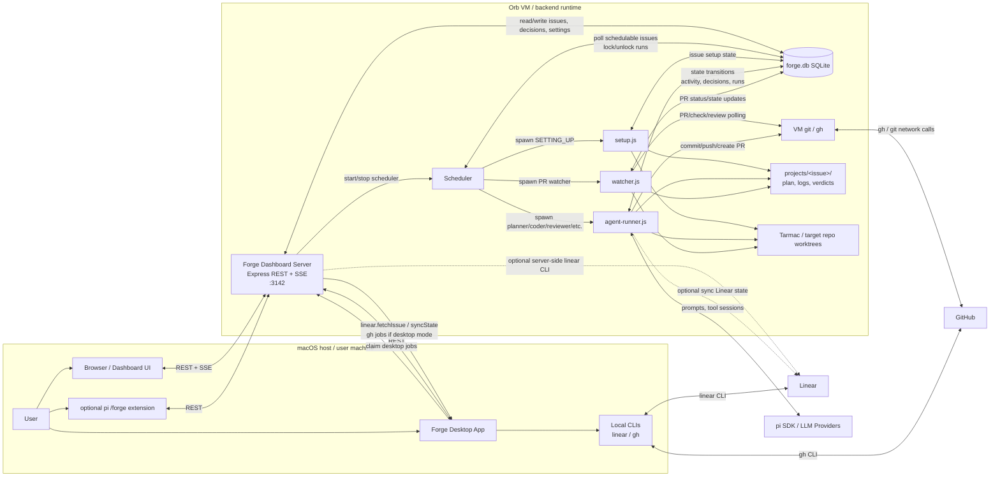
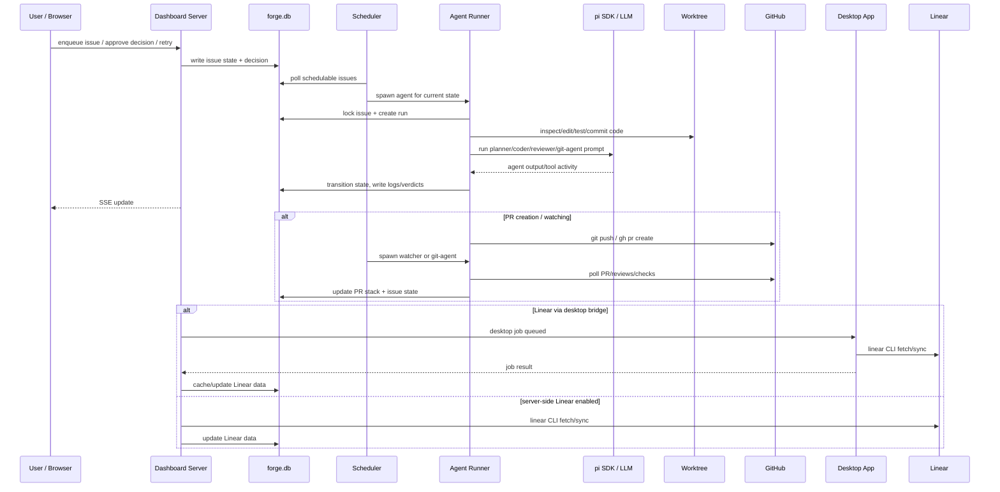

# Forge Service Architecture

## Main interactions

## Responsibilities

| Component | Runs where | Responsibility |
|---|---|---|
| Dashboard UI | Browser on macOS | Human control plane: queue, approve, retry, inspect logs/diffs. |
| Desktop app | macOS | Native wrapper and bridge for local `linear`/`gh` auth when VM should not own those credentials. |
| Dashboard server | VM | REST/SSE API, DB owner, settings, decisions, issue actions, desktop job API. |
| SQLite DB | VM | Source of truth for issue state, decisions, settings, runs, PR stack. |
| Scheduler | VM | Polls DB and spawns deterministic scripts/agents for schedulable states. |
| setup.js | VM | Creates project files and worktrees, then moves issue to planning. |
| agent-runner.js | VM | Runs planner/coder/reviewer/git/fixer agents via pi SDK; performs state transitions. |
| watcher.js | VM | Polls GitHub PR status, checks, reviews, merge queue, and marks issues done or needing fixes. |
| Worktrees | VM-mounted/macOS paths | Target repository checkout where agents edit, test, commit, and push code. |
| GitHub | External | PRs, branches, reviews, checks, merge state. |
| Linear | External | Issue source and state sync. |
